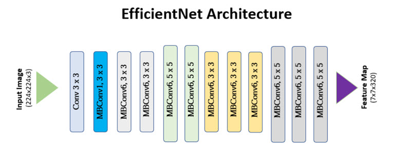

# open set recognition clustering-of 102-flowers dataset 

## Decription:
In this project we Comprehensive Framework to address both Openset recognition and 
determine the label/cluster of new unseen classes.
Our model consists of two different part, in first part we try to utilize deep neural network 
to extract more generizable embedding from Input data. And also separate the seen classes 
(and classify it ) from unseen new class. In second part we try to cluster the unseen new 
classes with Non-Parametric Bayesian models to achieve more accurate result in test time. 
In next paragraphs we will dive into the technical details of each block.
In first module we use EfficientNet[1] structure as a base model. EfficientNet is a 
convolutional neural network architecture and scaling method that uniformly scales all 
dimensions of depth/width/resolution using a compound coefficient. This network has an 
architecture as follow :

   

   

## References 
[1] Koonce, B. and Koonce, B., 2021. EfficientNet. Convolutional Neural Networks with 
Swift for Tensorflow: Image Recognition and Dataset Categorization, pp.109-123.
[2] Cubuk, E.D., Zoph, B., Shlens, J. and Le, Q.V., 2020. Randaugment: Practical automated 
data augmentation with a reduced search space. In Proceedings of the IEEE/CVF 
conference on computer vision and pattern recognition workshops (pp. 702-703).
[3] Vaze, S., Han, K., Vedaldi, A. and Zisserman, A., 2021. Open-set recognition: A good 
closed-set classifier is all you need. arXiv preprint arXiv:2110.06207.
[4] Jaiswal, Ashish, Ashwin Ramesh Babu, Mohammad Zaki Zadeh, Debapriya Banerjee, 
and Fillia Makedon. "A survey on contrastive self-supervised learning." Technologies 9, 
no. 1 (2020): 2.
[5] Khosla, Prannay, Piotr Teterwak, Chen Wang, Aaron Sarna, Yonglong Tian, Phillip 
Isola, Aaron Maschinot, Ce Liu, and Dilip Krishnan. "Supervised contrastive learning." 
Advances in neural information processing systems 33 (2020): 18661-18673.

	
